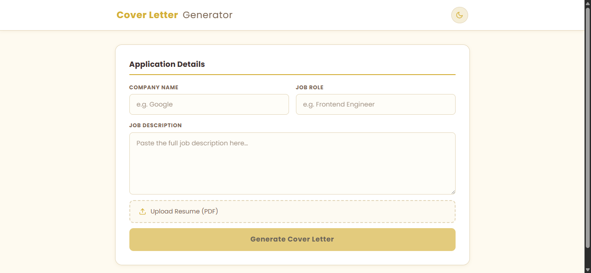
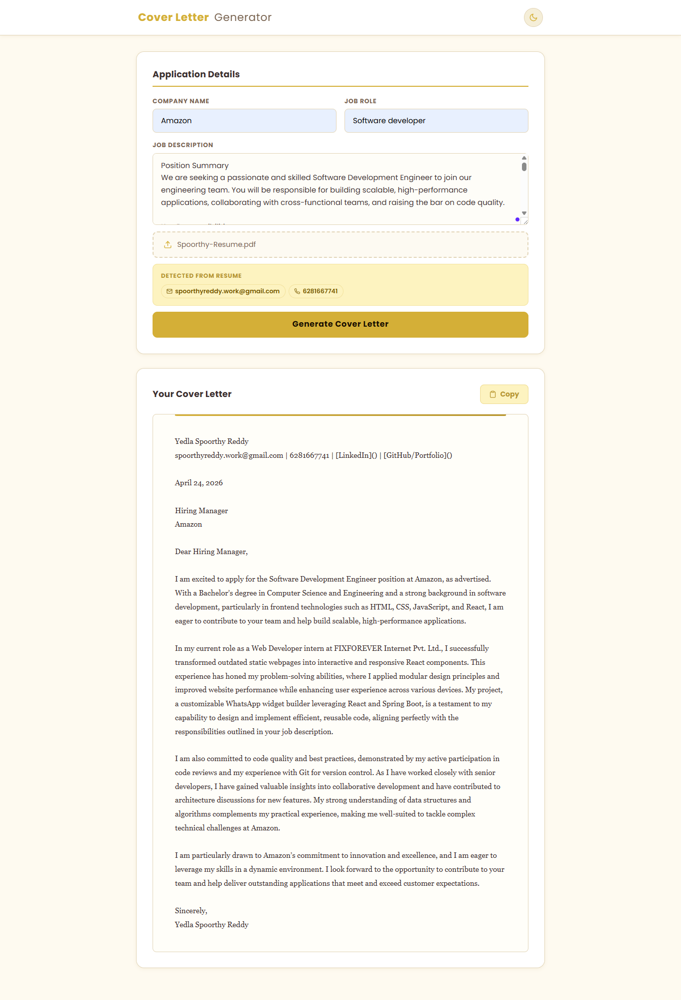

# AI Cover Letter Generator

A web app that reads your resume (PDF) and generates a personalized, professional cover letter using AI — in seconds.

---

## What This Project Does

You upload your resume as a PDF, fill in the company name, job role, and paste the job description. The app parses your resume, pulls out your contact details (name, email, phone, LinkedIn, GitHub, portfolio), and sends everything to an AI model. The AI then writes a properly formatted cover letter with your real information already filled in — no placeholders, no copy-pasting your details manually.

---

## Screenshots





---

## What I Built

- **PDF Parsing** — used `pdfjs-dist` to extract text from uploaded resumes, then wrote regex patterns to pull out contact info like email, phone number, LinkedIn and GitHub URLs
- **AI Integration** — connected to OpenRouter's API to use GPT-4o-mini, wrote a clean prompt that feeds the resume and job description and gets back a formatted letter
- **Dark / Light Mode** — added a toggle using `react-icons` that switches the whole UI theme using CSS variables
- **Responsive UI** — built a two-column form layout that collapses to single column on mobile, styled with a warm gold and cream color palette
- **Contact Preview** — after uploading a PDF, the app shows chips for every piece of contact info it detected, so you can verify before generating

---

## What I Learned

This was my first time working with `pdfjs-dist` and it was honestly tricky. The version mismatch between the API and the worker file was a real blocker — I was pointing to a CDN worker URL from an old version, and it kept throwing errors until I switched to importing the local worker file using Vite's `?url` import.

Writing the AI prompt also took more thought than I expected. My first version was too complicated and the output kept including placeholders instead of real data. Simplifying the prompt and explicitly listing the extracted contact info at the top fixed it.

Setting up CSS variables for theming was something I enjoyed. Having a single source of truth for colors made the dark mode toggle feel clean — just toggling a class on the `<html>` element swaps the entire palette.

---

## Tech Stack

| Tool | Purpose |
|---|---|
| React 19 | UI framework |
| Vite | Build tool and dev server |
| Tailwind CSS v4 | Utility classes |
| pdfjs-dist | PDF text extraction |
| Axios | API requests |
| OpenRouter (GPT-4o-mini) | AI cover letter generation |
| react-icons | Sun/moon toggle and UI icons |

---

## How to Run

```bash
npm install
npm run dev
```

Create a `.env` file in the root and add your OpenRouter API key:

```
VITE_OPENROUTER_API_KEY=your_key_here
```

Then open `http://localhost:5173` in your browser.

---

## How to Use

1. Enter the **company name** and **job role**
2. Paste the **job description**
3. Upload your **resume as a PDF**
4. Check the detected contact info chips
5. Click **Generate Cover Letter**
6. Copy the result with the **Copy** button
